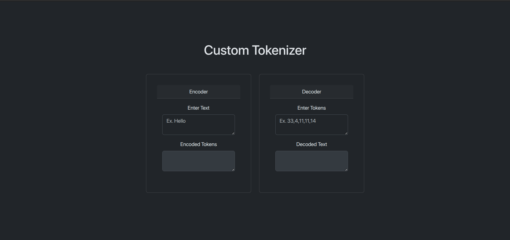
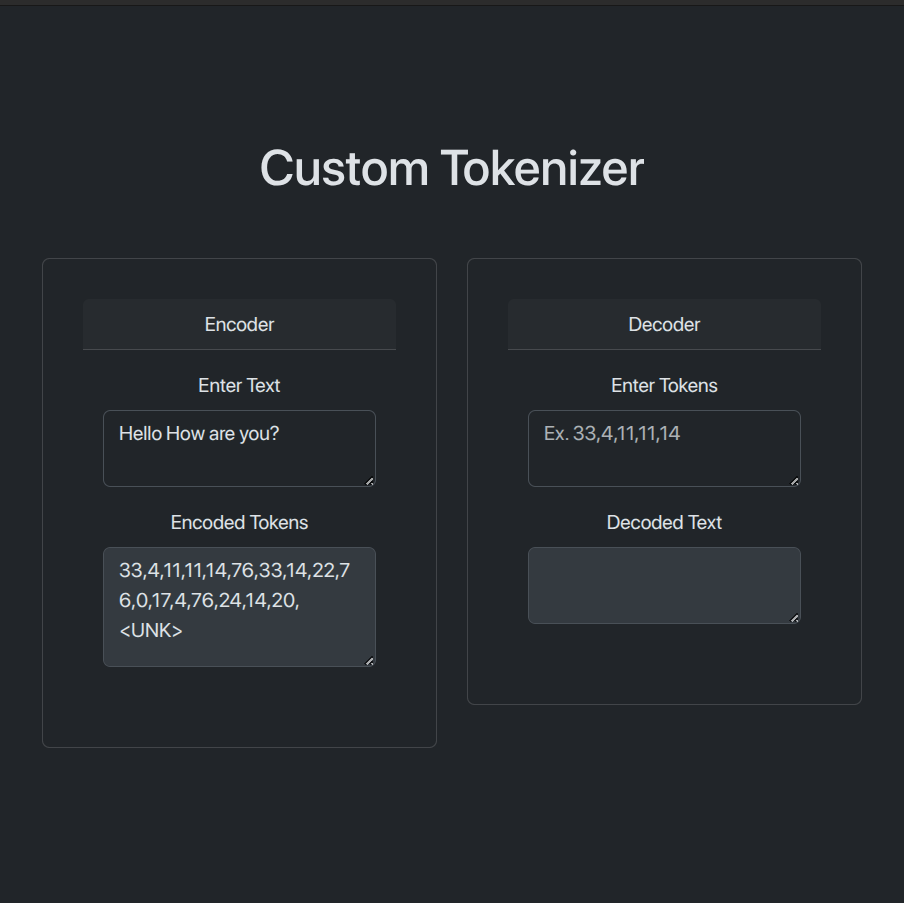
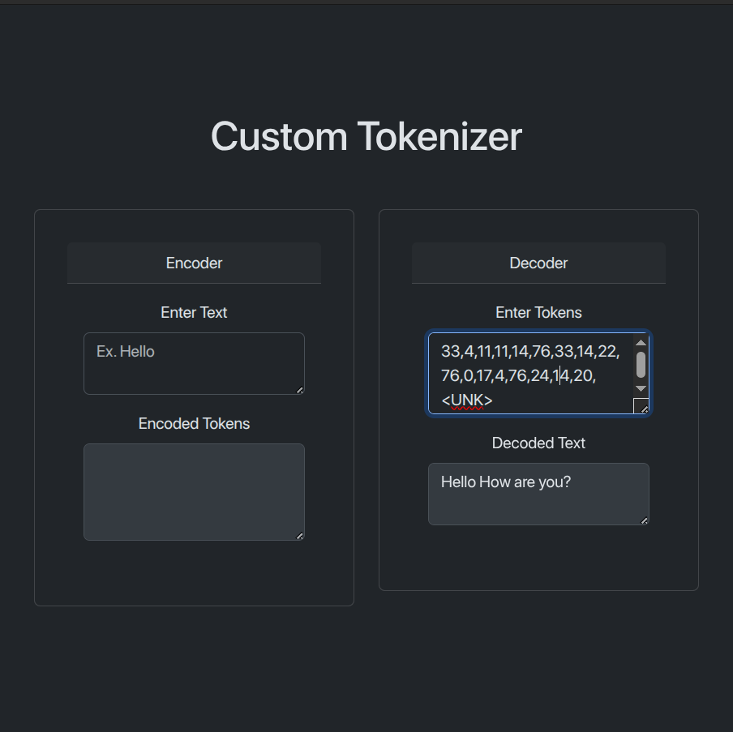

# Custom Tokenizer

A tokenizer built in Vue.js — Whether you're preprocessing text for NLP tasks or just exploring how tokenization works, this tool gives you a clean interface for encoding and decoding character-level tokenization.

---

## 🚀 Features

-   Character-level tokenization
-   Handles unknown tokens with `<UNK>`
-   Live demo deployed on Vercel

---

## Screenshots

Here’s a quick look at the app in action:

### 🔹 Home Page

### 🔹 Tokenization Encoding Demo

### 🔹 Tokenization Decoding Demo

---

## Live Demo

Try it out now: [Tokenizer on Vercel](https://custom-tokenizer-steel.vercel.app/)

---
